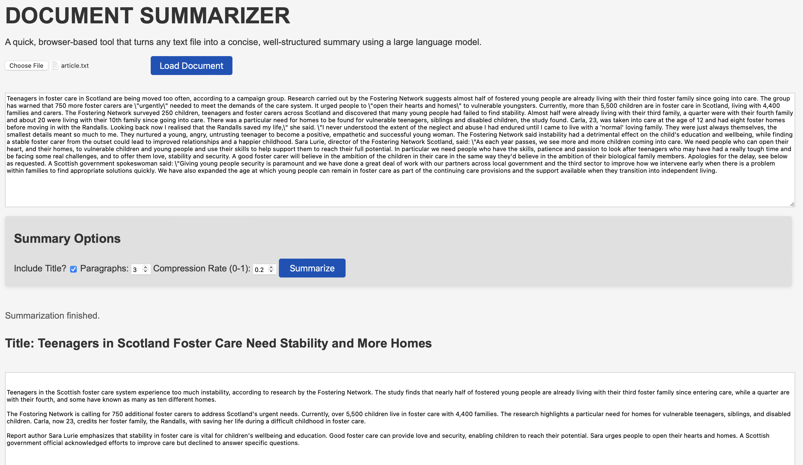

# Document Summarizer



A lightweight Flask app that turns a text document into a concise summary using a language model.

---

## Quick start

```bash
# install dependencies
pip install -r requirements.txt

# run the web server
python app.py
```

Open <http://localhost:8000> in your browser. Select a text file, click **Load Document**, then **Summarize**.

---

## How it works

1. **Load** – The browser reads the selected file and displays the full text.
2. **Summarize** – The client POSTs the text to `/summarize`. The Flask route forwards the content to a `BestHitLLMSummarizer` instance.
3. **LLM** – The summarizer builds a prompt that lists the content and the desired requirements, asks the LLM for candidate summaries, and runs a judge to pick the best report.
4. **Display** – The best summary is returned as JSON and shown in the page.

The summarizer uses the `BestHitLLMSummarizer` class from `main.summarizer`. It can be configured to use any OpenAI‑compatible API endpoint.

---

## Customization

The web UI exposes several controls that let users tailor the output:

- **Include Title** – Toggle whether a title is generated.
- **Paragraphs** – Set the maximum number of paragraphs in the summary.
- **Compression Rate** – Adjust the overall length of the output.

These values are sent to the backend and passed to the `BestHitLLMSummarizer`.

## Plug‑in LLMs

`BestHitLLMSummarizer` accepts any OpenAI‑compatible client. To use a commercial model just set `OPENAI_API_KEY` and `OPENAI_BASE_URL`. For open‑source models (e.g. Ollama, locally‑hosted) point `OPENAI_BASE_URL` to the model’s endpoint and provide the same key or leave it empty.

## Configuration

```text
# .env or environment variables
OPENAI_API_KEY=YOUR_KEY
OPENAI_BASE_URL=http://localhost:11434/v1
```

The defaults in `app.py` point to a local Ollama instance.

---

## Testing

```
poetry run python -m unittest
```

The repository contains a single test that ensures `Document.load_from_local` and `Document.pprint` behave correctly.

---

## Extending

* Add new metrics or requirements in `main.requirements`.
* Create a custom prompt template in `prompts/templates`.
* Replace the LLM client with another provider.

---

## License

MIT © 2026
